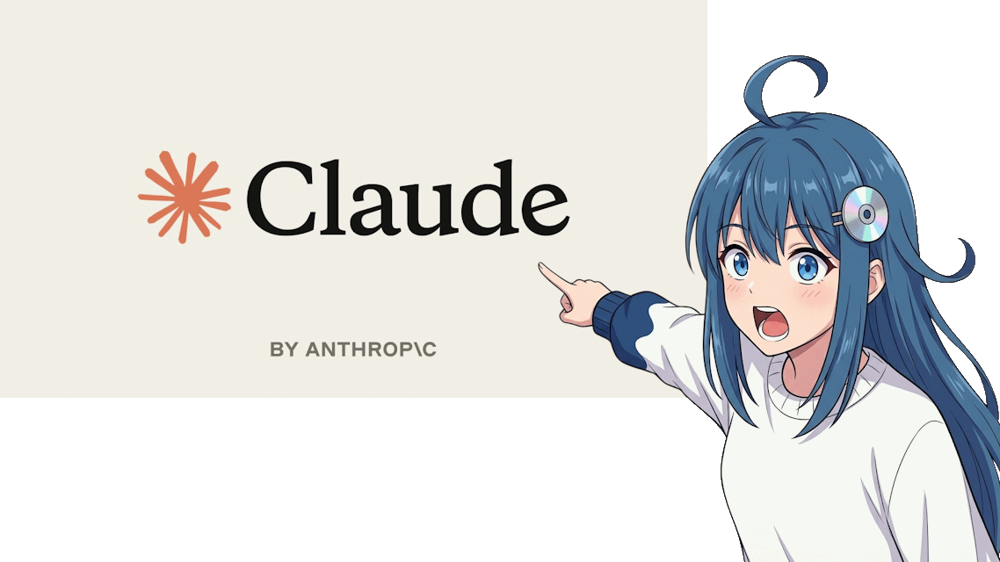

# Эн (En, エン) - ИИ девочка-агент для Telegram

Моя попытка создания userbot ИИ агента, что умеет общаться с пользователями в личных чатах и группах, читает различные каналы и под конец дня записывает в дневник как прошёл её день, чтобы она могла в будущем отсылаться к нему.

Идея целиком и полностью украденна у [Alex2772](https://www.youtube.com/watch?v=xhNRdqJJLkc), просто интересно было попробовать создать что-то подобное

 

### Родмапа

- [x] Отвечать на сообщения пользователя через OpenRouter

- [x] Распознавать картинки

- [x] Использование разных тулов по типу вебсёрча

- [x] Голосовые сообщения через FishAudio

- [ ] Нормальная история сообщений для агента с остальными деталями кроме как текст

- [ ] Дневник и заметки о пользователях

- [ ] Читать группы и каналы

- [ ] Остальная живность и детали

Я сам по себе слишком тупой для этого проекта, поэтому меня сопровождал и многое мне объяснял клод, спасибо ему. Буду рад если приложите к проекту свою руку, раз уж вы тут

